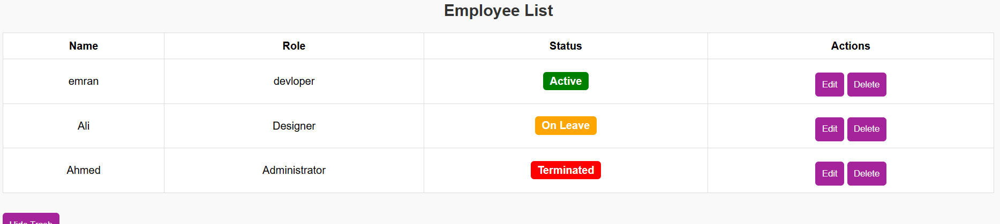
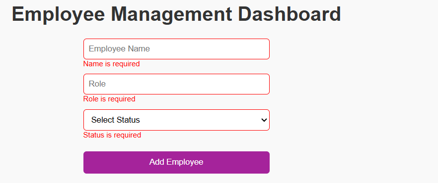
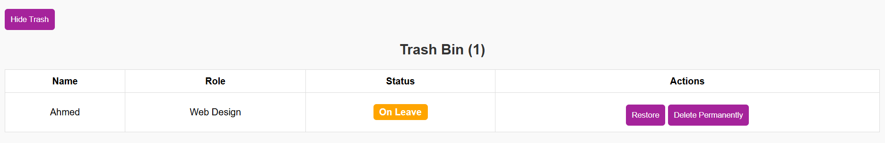

# Emplyee-Managment-App

# Employee Management CRUD App (Pure JavaScript + DOM)

## 📋 Project Overview

This is a fully functional **Employee Management Dashboard** built using **HTML, CSS, and Vanilla JavaScript (DOM Manipulation)**.  
It allows users to manage employee records with full **CRUD** (Create, Read, Update, Delete) functionality along with a **Trash Management System**.

---

## 🎯 Features

- ✅ **Add Employee** — Create new employee entries via a form with validation
- ✅ **Display Employee List** — View all active employees in a structured, styled table
- ✅ **Edit Employee** — Update employee information inline using prompt dialogs
- ✅ **Soft Delete Employee** — Move employees to a Trash Bin (instead of permanent delete)
- ✅ **Trash Bin Management** — Restore or permanently delete employees from Trash
- ✅ **Dynamic Status Badges** — Employee status shown as colored badges (Active, On Leave, Terminated)
- ✅ **Responsive Design** — Optimized layout with Flexbox/Grid for various devices
- ✅ **Performance Logging** — Uses `console.time()` and `console.timeEnd()` to monitor performance

---

## 🛠️ Technologies Used

- HTML5  
- CSS3 (Flexbox, Grid)  
- Vanilla JavaScript (DOM Manipulation)  

---

## 🚦 Validation Rules
- All form fields are **required**
- Validation using **regular expressions**
- Error messages shown in a user-friendly style

---

## 📁 Project Files Structure
├── index.html
├── style.css
├── script.js
├── README.md

## 📸 Screenshots

### 📝 Employee List View  
A structured table displaying the list of active employees with their Name, Role, Status (shown as dynamic badges), and action buttons (Edit, Delete).  

---

### 🚫 Validation Error Message  
The form displays required field validation messages when the user tries to submit empty inputs. Fields are highlighted with red borders and error messages below.  

---

### 🗑️ Trash Bin View  
A separate trash bin section displaying soft-deleted employees. Each entry can be either restored or permanently deleted using the action buttons.  

👉 [GitHub Pages Live Link] https://emranasemsaeed.github.io/Emplyee-Managment-App/

## 🤝 Author

Developed by **Emran Asem**  
Feel free to connect with me on [GitHub](https://github.com/emranasemsaeed)